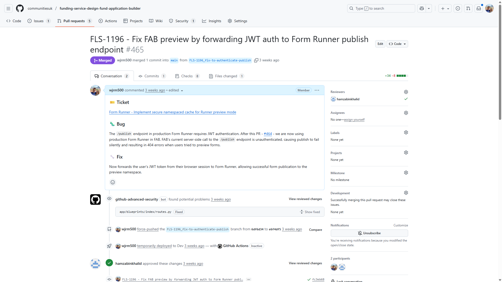
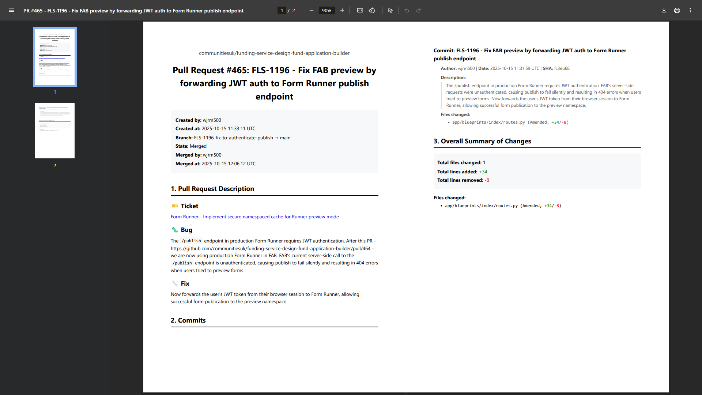

# PRtoPDF

Convert GitHub pull requests to professional PDF documents for evidence and documentation purposes.

## Example

Transform a GitHub pull request into a clean, formatted PDF document:

### GitHub Pull Request


### ⬇️ Converts to ⬇️

### Generated PDF


## Features

- 📄 Generates clean, well-formatted PDF reports from GitHub PRs
- 🎨 Full markdown support (headings, lists, code blocks, tables, images, emojis)
- 📝 Includes PR metadata, description, commits, and file changes
- 🔒 Optional anonymisation mode (removes usernames)
- ⚡ Fast caching of GitHub API requests
- 🎯 Works with both public and private repositories

## Requirements

- Python 3.11 or higher
- [uv](https://docs.astral.sh/uv/) package manager

## Installation

### 1. Install uv (if you haven't already)

**Windows:**
```powershell
powershell -ExecutionPolicy ByPass -c "irm https://astral.sh/uv/install.ps1 | iex"
```

**macOS/Linux:**
```bash
curl -LsSf https://astral.sh/uv/install.sh | sh
```

### 2. Clone the repository
```bash
git clone https://github.com/wjrm500/prtopdf.git
cd prtopdf
```

### 3. Install dependencies and set up the project
```bash
# Sync all dependencies and install the project in editable mode
uv sync
```

That's it! `uv sync` automatically:
- Creates a virtual environment (`.venv`)
- Installs all dependencies
- Installs your project in editable mode
- Sets up pre-commit hooks (if you run `uv run pre-commit install`)

### 4. Install Playwright browser

For PDF generation, you need to install the Chromium browser (one-time setup):
```bash
uv run playwright install chromium
```

This downloads Chromium (~300MB) to a Python-managed cache directory.

### 5. (Optional) Set up GitHub token for private repositories

Create a `.env` file in the project root:
```bash
GITHUB_TOKEN=ghp_your_token_here
```

Or set it as an environment variable:
```bash
# Windows
set GITHUB_TOKEN=ghp_your_token_here

# macOS/Linux
export GITHUB_TOKEN=ghp_your_token_here
```

Get your token from: https://github.com/settings/tokens

## Usage

### Basic usage
```bash
uv run prtopdf https://github.com/owner/repo/pull/123
```

This generates a file named `PR-123-evidence.pdf` in the current directory.

### Anonymise output (remove usernames)
```bash
uv run prtopdf https://github.com/owner/repo/pull/123 --anonymise
```

### Disable caching (always fetch fresh data)
```bash
uv run prtopdf https://github.com/owner/repo/pull/123 --no-cache
```

### Combine flags
```bash
uv run prtopdf https://github.com/owner/repo/pull/123 --anonymise --no-cache
```

## Development

### Running tests and linters
```bash
# Install pre-commit hooks
uv run pre-commit install

# Run all pre-commit checks manually
uv run pre-commit run --all-files

# Format code
uv run black .

# Type check
uv run mypy .

# Lint
uv run flake8
```

### Adding dependencies
```bash
# Add a runtime dependency
uv add package-name

# Add a dev dependency
uv add --dev package-name
```

After adding dependencies, run `uv sync` to update the lockfile and virtual environment.

### Project structure
```
prtopdf/
├── src/prtopdf/
│   ├── __init__.py
│   ├── main.py              # CLI entry point
│   ├── generator.py         # PDF generation with Playwright
│   ├── formatters.py        # Text/markdown formatting
│   ├── github_api.py        # GitHub API client
│   └── templates/
│       └── pr_report.html   # Jinja2 template for PDF
├── pyproject.toml           # Project configuration
├── uv.lock                  # Dependency lockfile
└── README.md
```

## How it works

1. **Fetches PR data** from GitHub API (with caching)
2. **Renders markdown** to HTML using Python markdown library
3. **Generates PDF** using Playwright's headless Chromium browser
   - Playwright opens the HTML in Chrome
   - Chrome's built-in "Print to PDF" creates the final document
   - This ensures perfect emoji and formatting support

## Troubleshooting

### "Command not found: prtopdf"

Make sure you're using `uv run`:
```bash
uv run prtopdf <url>
```

### GitHub API rate limiting

Without a token, you're limited to 60 requests/hour. Set up a `GITHUB_TOKEN` to increase this to 5,000 requests/hour.

### Playwright browser not installed

If you see errors about missing browsers:
```bash
uv run playwright install chromium
```
